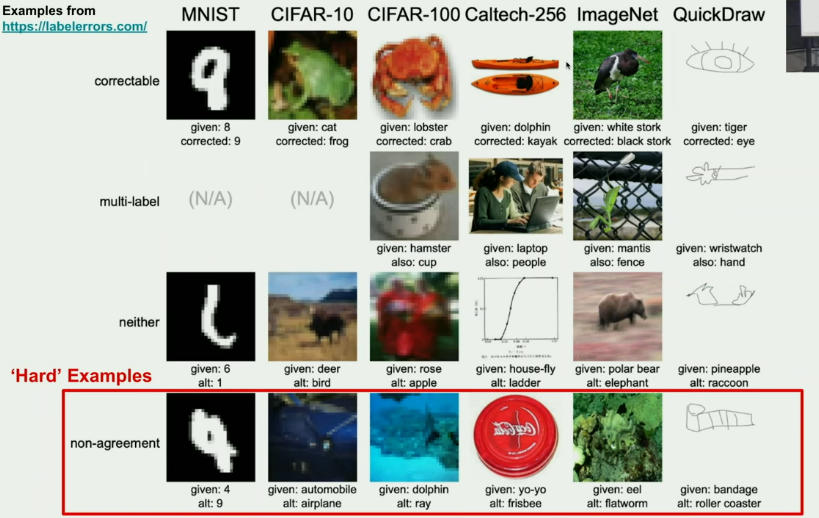

# Label Errors

- There are many types of label error, 4 of them are:
  - **Correctable**
    Obviously, wrong label that we can correct. (**FOCUS OF LECTURE**)
  - **Multi-label**
    - if you look at the hamster in the cup, neither of these are wrong. but the model outputs a single label
  - **Neither**
    - Both labels are incorrect 
  - **Non-agreement**
    - Even humans get confused with them, first on the left could be a 4 or 9 depending on who you ask.

****

