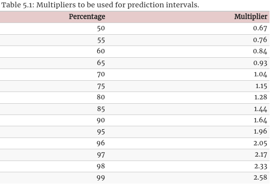

[toc]

# The Forecaster's toolbox

- This chapter will describe some benchmakr forecasting methods and procedures for checking whether a forecasting method has adequately utilised the available information.

## Tidy forecasting workflow

- The process of producing forecasts for time series data can be broken down into a few steps

  
  - We will fit linear trend models to national GDP data stored in `global_economy`

### Data Preparation (Tidy)

- The first step in forecasting is to **prepare** data in the **correct format**
  - This may involve loading data, handling missing values, filtering the time series, and other pre-processing tasks

- Many **models** have **different data requirements** 
  - Some require the series to be in **time order** 
  - Others require **no missing values**

- Checking the data is an essential step to understand its features.

### Plot the data (Visualise)

- Discussed in chapter 2

### Define a model (Specify)

- Different models can be used and specifying an **appropriate model** for the **data** is essential for **producing appropriate forecasts**.

### Train the model (Estimate)

- After choosing an appropriate model, the next step is to train it

### Check model performance (Evalute)

- Similar to ML

### Produce Forecasts (Forecast)

- Similar to ML

----------

## Simple forecasting methods

- We'll define 4 simple methods to forecast time series
- **Sometimes** one of these simple methods will be the **best forecasting method available**
  - But in many cases, these methods will serve as a benchmark rather than the method of choice. (baseline models)

### Mean Method

- The forecast of all future values are equal to the **mean of the historical data** 
  $$
    \hat y_{T+h|h} = \bar y = \frac{y_1 + .... + y_T}{T}
  $$
  - The notation $\hat y_{T+h|h}$ is short hand for estimating $y_{T+h}$ based on the data $y_1,....,y_T$

### Naive method

- We set the forecast to be the value of the **last observation** 
  $$
    \hat y_{T+h|h} = y_T
  $$
 
  - This method works remarkably well for many economic and financial time series

  
    - Naive forecast applied to clay brick production in Australia

### Seasonal naive method

- Useful for **highly seasonal data** 

- We set each forecast to be equal to the **last observed value from the same season** 
  - Jan 2021 = Jan 2022
  $$
    \hat y_{T+h|h} = y_{T + h - m(k+1)}
  $$
    - Where $m$ is the seasonal period, and $k$ is the integer part of $\frac{h-1}{m}$ (i.e. the number of complete years in the forecast period prior to time $T+h$)
 
### Drift Method

- A variation of the naive method that allows the forecast to **change over time**
  - The amount of change over time is called **drift**
  - drift is set to be the **average change seen in historical data** 
  $$
    \hat y_{T+h|h} = y_T + \frac{h}{T-1} \sum^T_{t=2} (y_t - y_{t-1}) = y_T + h (\frac{y_T - y_1}{T-1})
  $$
    - This is similar to drawing a line between the first and last observation and extrapolating into the future.

### Example on simple methods

 

- Only seasonal naive did well

----------

## Fitted values and Residuals

### Fitted values

- Each observation in a time series can be forecast using all previous observations
  - We call these **fitted values** denoted by $\hat y_{t|t-1}$ or just $\hat y_t$ for simplicity

- Fitted values almost always involve **one-step forecasts**.

- Not all fitted values are forecasts.
  - If an examples requires future data, then not true forecast.

- So a model that assigns the mean of all values to all forecast is a fitted value that is not a true forecast.

----------

### Residuals

- Residuals in a time series model are what is left over after fitting a model
  $$
    e_t = y_t - \hat y_t
  $$

- If a transformation has been used in the model, it is often useful to look at the residuals in the **transformed scale** 
  - We call these **innovation residuals** 
  - For example, if we modelled the data as follows $w_t = \log y_t$, then the **innovation residuals** are given by $w_t - \hat w_t$, while the regular residuals are given by $y_t - \hat y_t$
   
- Residuals are useful in checking whether a model has adequately captured the information in the data.

- If patterns are observable in the innovation residuals, then the model can probably be improved
  - Discussed in the next point : Residual diagnostics

----------

### Residual diagnostics

- A good forecasting method will yield innovation residuals with the following properties
  1. The innovation residuals are **uncorrelated** 
    - If there are correlations between innovation residuals, then there is information left in the residuals which should be used in computing forecasts.
  2. The innovation residuals have **zero mean** 
    - Any mean other than zero means that the forecasts are biased

- Any model that doesn't have one of these **can be improved**.
  - However, that doesn't mean that model that satisfy these properties cannot be improved.

- Using these properties is not a good way to do **model selection**
  - As multiple models can satisfy these properties on the same dataset.

- To correct the non zero mean, simply subtract it from the model by adding a constant $c$
- Correcting the zero correlation problem is harder and will be discussed later on.

----------

- In addition to these **essential** properties, it is **useful (but not necessary)** for the residuals to also have the following two proprties
  3. The **innovation** residuals have **constant variance**  
    - Known as **homoscedasticity** 
  4. The **innovation** residuals are **normally distributed** 

- These two properties make the calculation of prediction intervals easier (examples later)
  - However, a forecasting model that **doesn't satisfy** these properties **cannot necessarily be improved**.

- Sometimes applying a **Box-Cox transformation** may assist with these properties, but otherwise there is **usually little that you can do** to ensure that the innovation residuals have constant variance and a normal distribution

- It'll  be shown later how to deal with non-normal innovation residuals

----------

### Portmanteau tests for autocorrelation

- In addition to looking at the ACF plot, we can do more formal  tests for autocorrelation by considering a whole set of $r_k$ values as a **group** instead of treating each one separately

- Recall that $r_k$ is the autocorrelation for lag $k$, sometimes the ACF will say that there is correlations when there is not (due to the 95% confidence interval)
- To overcome this problem, we test whether the first $l$ autocorrelations are significantly different from what would be expected from a **white noise process** 

- A test for a group of autocorrelations is called a **portmanteau test**

#### Box-Pierce test
- One such test is the **Box-Pierce test**

  $$
    Q = T \sum^l_{k = 1} r^2_k
  $$
  - $l$ is the max lag being considered, and $T$ is the number of observations.

- If each $r_k$ is close to zero, then $Q$ will be small
  - If some $r_k$ values are large, $Q$ will be large too.

- The suggested value of $l$ 
  - $l = 10$ for non-seasonal data
  - $l = 2m$ for seasonal data
    - where $m$ is the period of seasonality
    - However, the test isnt good when $l > T/5$, so if $l > T/5$ clip it so it becomes $l = T / 5$

#### Ljung-Box test

- More accurate than **Box-Pierce test** 

  $$
    Q^* = T(T+2) \sum^l_{k=1} \frac{r^2_k}{T-k}
  $$

- Large values of $Q^*$ suggests that the autocorrelations don't come from a white noise series.

----------

- How large is too large ?
  - If autocorrelations did come from a white noise, then both $Q$ and $Q^*$ would have a $\mathcal{X}^2$ distribution with $(l - K)$ degrees of freedom.
    - $K$ is the number of paramters of the model
    - If the paramters are calculated from raw data (rather than the residuals), then set $K = 0$.

----------

## Distributional forecasts and prediction intervals

### Forecast distributions

- We express the uncertainty in our forecasts using a **probability distribution**
  - It describes the probability of **observing future values using the fitted model** 

- The point forecast is the **mean of this distribution**

- Most time series models produce **normally-distributed forecasts** 
  - i.e. we assume that the distribution of possible future values follows a normal distributions

- We'll look at a couple of alternatives to normal distributions later on

----------

### Prediction intervals

- A prediction interval gives an interval.
  - We expected $y_t$ to lie in **that interval** with a **specified probability** 

- For example, if we assume that the distribution of future observations is normal, a 95% prediction interval for the $h$-step forecast is
  $$
    \hat y_{T+h|T} \pm 1.96 \hat \sigma_h
  $$
  where $\hat \sigma_h$ is an estimate of the standard deviation of the $h$-step forecast distribution

- More generally, a prediction interval can be written as
  $$
    \hat y_{T+h|T} \pm c \hat \sigma_h
  $$
  where the multiplier $c$ depends on the coverage probability
  - We usually calculate $80%$ intervals and $95%$ intervals, although any percentage may be used.

- The value of prediction intervals is that they **express the uncertainty** in the forecasts.
  - If we only produce point forecasts, there is no way of telling how accurate the forecasts are

- Point forecasts can be of almost no value without the accompanying prediction intervals

----------

### One-step prediction intervals

- When forecasting one step ahead, the standard deviation of the forecast distribution can be estimated using the standard deviation of the residuals given by
  $$
    \hat \sigma = \sqrt{\frac{1}{T - K - M} \sum^T_{t=1} e_t^2}
  $$
  where $K$ is the number of parameters estimated in the forecasting method, and $M$ is the number of missing values in the residuals.
    - e.g. $M = 1$ for a naive forecast as we can't forecast the first observation

#### Example

- If we consider a naive forecast for the Google stock price data
  
  - The last value of the observed series is $758.88$, so the forecast for the next value is $758.88$.
    - The standard deviation of the residuals is $11.19$ (has a form discussed in 5.1)
  - So with a 95% prediction interval for the next value is given as 
    $$
      758.88 \pm 1.96 (11.19) = [736.9, 780.8]
    $$

----------

### Multi-step prediction intervals

- A common feature of prediction intervals is that they usually increase in length as the forecast horizon increases.
  - The further ahead we forecast, the more uncertainty is associated with the forecast, thus the wider the prediction intervals
  - That is, $\sigma_h$ usually increases with $h$ (although some non-linear forecasting methods don't have this property)

- To produce a prediction interval, it is necessary to have an estimate of $\sigma_h$
  - For one step forecasts $h=1$, the equation from 5.1 provides a good estimate of the forecast std dev $\sigma_1$.
  - For multi-step forecasts, a more complicated method of calculation is required
    - These calculations assume that the residuals are **uncorrelated**

----------

### Benchmark methods

- For the 4 benchmark methods, it is possible to mathematically derive the forecast standard deviation under the assumption of uncorrelated residuals.

  - If $\hat \sigma_h$ denotes the standard deviation of the $h-$step forecast distribution, and $\hat \sigma$ is the residual standard for $h=1$.
    - We can then use expressions from the table below to approximate these values

  | Benchmark method   | $h-$step forecast standard deviation    |
  |--------------- | --------------- |
  | Mean   | $\hat \sigma_h = \hat \sigma \sqrt{1 + \frac{1}{T}}$   |
  | Naive   | $\hat \sigma_h = \hat \sigma \sqrt{h}$ |
  | Seasonal naive   | $\hat \sigma_h = \hat \sigma \sqrt{k + 1}$    |
  | Drift   | $\hat \sigma_h = \hat \sigma \sqrt{h \frac{1 + h}{T - 1}}$  |

- Example for confidence intervals
     

----------

### Prediction intervals from bootstrapped residuals

- When a **normal distribution** for the residuals is an **unreasonable assumption**
  - one alternative is to use **bootstrapping** which only assumes that the residuals are **uncorrelated** with **constant variance** 

- A one-step forecast error is defined as $e_t = y_t - \hat y_{t|t - 1}$
  $$
    y_t = \hat y_{t|t - 1} + e_t
  $$
  - So we can simulate the next observation of a time series using
    $$
      y_{T+1} = \hat y_{T+1|T} + e_{T+1}
    $$
    Assuming that future error $e_{T+1}$ will be similar to past errors, we can replace $e_{T+1}$ by sampling from the collection of errors we have seen in the past.
  - After prediction, we add the simulated observation to our dataset, we repeat the process to obtain
    $$
      y_{T + 2} = \hat y_{T+2| T + 1} + e_{T+2}
    $$
    where $e_{T+2}$ is another draw from the collection of residuals.

  - If we continue this way, we can simulate an entire set of future values for our time series.
  
   
  Five simulated future paths of google closing stock price (naive method with bootstrapped residuals)
- Then we compute prediction intervals by calculating percentiles of the future sample paths for each horizon
  - The result is a **bootstrapped** prediction interval

----------

## Forecasting using transformations

- We've discussed some common transformations which can be used when modelling
  - when forecasting a model with transformations, we first produce forecasts on **transformed data**. Then, we **reverse the transformations** to obtain forecasts on the **original scale**

----------

### Prediction intervals with transformations

- If a transformation has been used, then the prediction interval is first computed on the transformed scale and the end points are **back-transformed** to give a prediction interval on the original scale.

### Bias adjustments

- One issue with using mathematical transformations such as Box-Cox transformations is that the back-transformed point forecast will **not be the mean of the forecast distribution**.
  - It will usually be the **median of the forecast distribution** (assuming that the distribution on the transformed space is symmetric)

- In many cases, this is **acceptable**, although the mean is usually **preferable**.
  - For example, you may wish to add up sales forecasts from various regions to form a forecast for the whole country
    - In that case, median would be bad as it doesn't add up, While means add up.

- When we modify the transformation to give the mean rather than the median, we say that point forecasts have been **bias-adjusted**

- Example using drift method (Mean vs Median)
   

----------

## Forecasting with decomposition

- Time series decomposition can be a useful step in producing forecasts

- Assuming an additive decomposition, the decomposed time series can be written as
  $$
    y_t = \hat S_t + \hat A_t \\
    \hat A_t = \hat T_t + \hat R_t
  $$
- Or in the case of a multiplicative decomposition
  $$
    y_t = \hat S_t \times \hat A_t
  $$

- To forecast a decomposed time series, we forecast the seasonal component $\hat S_t$ and the seasonally adjusted component $\hat A_t$ **separately**

- It is usually assumed that the seasonal component is **nearly unchanging**, so it is forecast by simply taking the **last year of the estimated component**
  - i.e. a **seasonal naive method** is used for the seasonal component

- To forecast the seasonally adjusted component, any non-seasonal forecasting method can be used (discussed in later chapters).

----------

## Testing and validation sets

- Similar to ML

### Time Rolling Cross-validation

- You start by training your data on the first $k$ examples, where $k < N$
  - You then predict the value of the $k + 1$ element
  - Increment $k$ and repeat until $k = N$
  
  - Blue is training, red is test, grey is ignored/not yet reached

- You can modify this to perform a multi-step forecast
  

----------

## Evaluating distributional forecast accuracy

TODO : Finish Later

- All the previous methods measued **point forecast accuracy**, so we'll need other measures when evaluation distributional forecasts

### Quantile scores

- If we consider the google stock price example with an 80% prediction interval for the forecasts from the naive method
  

  - The lower limit of this prediction gives the 10th percentile (0.1 quantile) of the forecast distribution.

