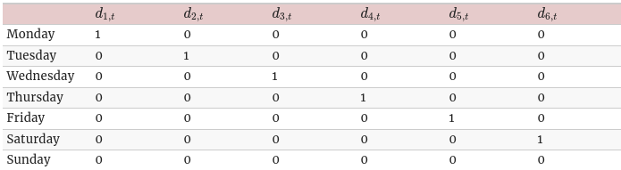
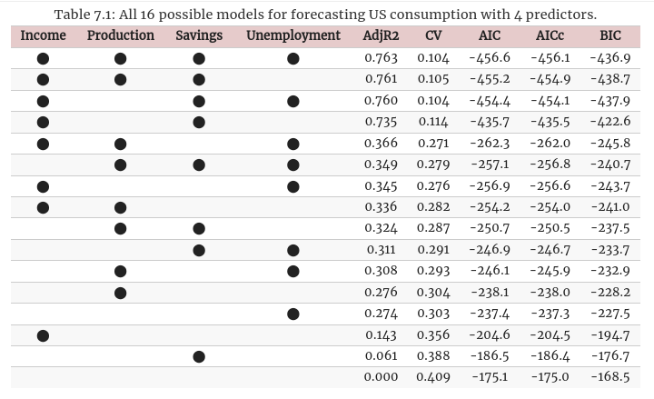

[toc]

# Time series regression models

- The basic concept is that we forecast the time series of interest $y$ assuming that it has a linear relationship with other time series $x$
  - e.g. forecasting daily electric demand $y$ using temperature $x_1$ and the day of the week $x_2$ as predictors.

- In this book, $y$ is referred to as the **forecast variable** and $\mathbf{x}$ is referred to as the **predictor variables** 

----------

## Linear Regression

- Explains linear regression all of which I previously studied except for the **Standard error of the regression** 

### Standard error of the regression

- Another measure of how well the model has fitted the data is the **standard deviation of the residuals**, often known as the **residual standard error**.
  $$
    \hat \sigma_e = \sqrt{\frac{1}{T - k - 1} \sum^T_{t = 1} e^2_t}
  $$
  - where $k$ is the number of parameters in the model.

- The standard error is related to the size of the average error that the model produces

- we can compare this error to the **sample mean of** $y$ or its standard deviation to gain some perspective on the accuracy of the model.

- The standard error will be used when **generating prediction intervals** later on in the chapter.

----------

## Evaluating the regression model
- The residuals have some useful properties including

  $$
    \sum^T_{t = 1} e_t = 0 \\
    \sum^T_{t = 1} x_{k,t} e_t = 0 \hspace{1em}  \text{for all k}
  $$

- As a result of these properties, the **average of the residuals** is zero
  - Also the **correlation** between the **residuals** and the **observations for the predictor variable** is also zero

- After selecting the regression variables and fitting a regression model, it is necessary to **plot the residuals** to check that the **assumptions of the model have been satisfied** 
  - There are a **series of plots** that should be produced in order to **check different aspects of the fitted model and the underlying assumptions**
    - We will discuss each of them in turn

----------

### ACF plot of residuals

- With time series data, it is highly likely that the **value of a variable** observed in the **current** time period will be **similar** to its value in the **previous** time period and the one before that and so on..

- Therefore, when fitting a regression model to time series data, it is common to find autocorrelation in the residuals.
  - In this case, the estimated model violates the assumption of **no autocorrelation in the errors** and our forecasts may be **inefficient**
    - There is some information left over which should be accounted for in the model to obtain better forecasts

- The forecasts from a model with autocorrelated errors are still unbiased, so they won't be wrong.
  - However, They will usually have **larger prediction intervals** than they need to.

- This is why we should always look at an ACF plot of the residuals

----------

### Histogram of residuals

- It is always a good idea to check whether the residuals are normally distributed
  - It is not essential for forecasting but makes **prediction interval calculation** much easier

----------

### Residual plots against predictors

- We should expect residuals to be **randomly scattered** without showing any systematic patterns.
- A simple way to check this would be to **examine scatterplots of the residuals against each predictor variable** 
  - If these scatterplots show a pattern, then the relationship may be nonlinear and the model will need to be modified accordingly
- You can also plot the residuals against predictor variables not in the model
  - If any of these show a pattern, then the corresponding predictor may need to be added to the model.

- Example
   

----------

### Residual plots against fitted values

- A plot of the residuals against the fitted values should also show no pattern.
  - If a pattern is observed, there may be **heteroscedasticity** in the errors (variance not constant)
  - if this problem occurs, a **transformation of the forecast variable** such as a logarithm or square root may be required

- Example
  

----------

### Outliers and influential observations

- In linear regression, outliers can greatly skew the model

- It is better to have two model, one with and without outliers

   

----------

### Spurious regression

(Spurious means false or fake)

- More often that not, time series data are **non-stationary** 
  - non-stationary means that it has non constant mean and non constant variance

- We will deal with stationary time series in chapter 9.
  - For now, we'll address the effect that non-stationary data can have on regression models

- The plot below shows a scatterplot between two variables that are correlated but don't affect each other (correlation != causation)
 

- Cases of spurious regression might appear to give reasonable short-term forecasts but will generally not continue to work into the future.
  - High $R^2$ and high residual autocorrelation can be signs on spurious regression.

  

----------

## Some useful predictors

- There are several useful predictors that occur frequently when using regression for time series data

### Trend

- It is common for time series data to be trending

- A **linear trend** can be modelled by using a predictor $x_{1,t} = t$.
  $$
    y_t = \beta_0 + \beta_1 t + \epsilon_t
  $$

----------

### Dummy variables

- Dummy variables are used for binary data like "is public holiday"
- They might also be used to account for **outliers** in the data.
  - Rather than remove the outlier, add a dummy variable and make it equal 1 if it is in that case.
    - e.g. Forecasting tourist arrival in Brazil, you'll need to account for the effect of Rio de Janeiro summer olympics in 2016

- If there are more than two categories, then the variable can be coded using several dummy variables (1 fewer than the number of categories)

----------

### Seasonal dummy variables

- Suppose that we are forecasting daily trend data and we want to account for the day of the week as a predictor
  - We can create the following dummy variables
    

  - Notice that we used **six dummy variables** to represent **7 days of the week**.
    As the 7th category (Sunday) is captured by the intercept (all zeros)

- Adding 7 dummy variables will represent 8 days which will cause the regression to fail

- The **intuition** behind this is that
  - The model is fit assuming that it is always Sunday
  - Whenever a dummy variable equals 1, this represents the difference between Sunday and the day corresponding to that dummy variable

- In the case of 7 dummy variables(1 for each day), it will fit according to an arbitrary day and try to find the difference between that day and the others.
  - Which doesn't make logical sense and why the regression fails

- So for monthly data, we create **11 dummy variables** and for quarterly data, we create **3 dummy variables**

----------

### Intervention variables

- Intervention variables can have different forms

#### Spike variable

- This is a variable that takes the value one in the **period of the intervention** and zero elsewhere.
  - Equivalent to a dummy variable for handling outliers

#### Step variable

- A variable that has an intermediate and permanent effect, causing a level shift (i.e. the value of the series changes **suddenly and permanently** from the time of intervention

- A step variable takes the value 0 **before the time of intervention** and the value 1 **from the time of intervention forward** 

----------

- Another form of permanent effect is a change of slope, here the intervention is handled using a **piecewise linear trend** 
  - a trend that bends at the time of intervention, which by definition makes it non-linear
    - Discussed in 7.7

----------

### Trading days

- The number of trading days in a month can vary considerably
- It could be useful to include it as a predictor.

- An alternative that accounts for different days of the week uses the following predictors

  $$
    x_1 = \text{number of Mondays in month} \\
    x_2 = \text{number of Tuesdays in month} \\
    .. \\
    .. \\
    x_7 = \text{number of Sundays in month} \\
  $$

----------

### Distributed lags

- Some features will have effects that can last beyond the month they were in.
  - e.g. advertising expenditure in a month will last beyond the actual campaign

- If you want to include those in your model, you may use the following predictors
  
  $$
    x_1 = \text{advertising for previous month} \\
    x_2 = \text{advertising 2 months ago} \\
    .. \\
    .. \\
    x_m = \text{advertising m months ago} \\
  $$

- It is quite common to decrease the coefficients as the lag increases but this is beyond the scope of the book.

----------

### Easter

- Easter is treated with a separate dummy variable as it doesn't always happen at the same date each year.

----------

### Fourier series

- An alternative to using seasonal dummy variables, especially for **long seasonal periods** is to use **Fourier terms** 

- If $m$ is the seasonal period, then the first few Fourier terms are given by
  $$
    x_{1,t} = \sin (\frac{2 \pi t}{m}) ,x_{2,t} = \cos (\frac{2 \pi t}{m})  \\
    x_{3,t} = \sin (\frac{4 \pi t}{m}) ,x_{4,t} = \cos (\frac{4 \pi t}{m})  \\
    x_{5,t} = \sin (\frac{6 \pi t}{m}) ,x_{6,t} = \cos (\frac{6 \pi t}{m})
  $$
  and so on.

- If we have monthly seasonality, and we use the first 11 of these predictor variables (11 Fourier terms)
  - We will get exactly the same forecasts as using 11 dummy variables

- The **benefit** of this is that, with **Fourier terms**, we often need **fewer predictors than with dummy variables** especially when $m$ is **large** 
- This makes them useful for weekly data, where $m = 52$.
  - While for **short seasonal periods** (e.g. quarterly data), there is **little advantage** to using Fourier terms over seasonal dummy variables

- If you only use the first two Fourier terms ($x_{1,t}$ and $x_{2,t}$), the seasonal pattern will follow a simple sine wave.

- A regression model containing Fourier terms is often called **harmonic regression** as the successive Fourier terms represent harmonics of the first two Fourier terms.

----------

## Selecting predictors

- A lot of predictors may lead to overfitting, so we need some strategy for selecting the best predictors to use in a regression model.

- A **common** approach that is **not recommended** is to **plot the variable against a particular predictor**
  - If there is no noticeable relationship, drop that predictor
  - This is invalid as it's not always possible to see the relationship from a scatterplot, especially when the effects of other predictors have not been accounted for.

- Another **common invalid** approach is to do a multiple linear regression on all the predictors
  - And diregard all the variables whose **$p$-values are greater than 0.05**
  - To start with, statistical significance doesn't always indicate the predictive value
  - Even if forecasting isn't the goal, that is not a good strategy because the $p-$values can be misleading when two or more predictors are correlated with each other.

----------

- Instead, we will introduce 5 ways to measure the **predictive accuracy**
  1. Adjusted $\mathcal{R}^2$
  2. Cross-validation
  3. Akaike's information criterion (AIC)
  4. Corrected Akaike's information criterion
  5. Schwarz's Bayesian information criterion (BIC)

----------

### Adjusted $\mathcal{R}^2$

- $\mathcal{R}^2$ is not a good measure of the predictive ability of a model, it measures how well the model fits the historical data, but not how well it will forecast future data

- Also, $\mathcal{R}^2$ doesn't allow for **degrees of freedom**, as adding more variables will lead to a better $\mathcal{R}^2$ measure even if it is due to overfitting

- An equivalent idea is to select the model that gives the **minimum sum of squared errors** given by :
  $$
    SSE = \sum_{t=1}^T e_t^2
  $$
  This is similar to maximizing $\mathcal{R}^2$, so still not a valid way of selecting predictors

- An **alternative** which is designed to **overcome these problems** is the **Adjusted $\mathcal{R}^2$** (R-bar squared)

  $$
    \bar R^2 = 1 - (1 - R^2) \frac{T - 1}{T - k - 1}
  $$
  where $T$ is the number of observations, $k$ is the number of predictors

- This is an improvement on $R^2$, as it'll no longer increase with each added predictor.

- Using this method, the best model will be the one with the largest value of $\bar R^2$
  - maximizing $\bar R^2$ is equivalent to **minimising the standard error** $\hat \sigma_e$

- This method works well for selecting predictors, although it does tend to **err** on the side of **selecting too many predictors** 

----------

### Cross-validation

- Train your separate models on the validation dataset and pick the one with the best performance.

----------

### Akaike's information criterion

- A closely related method is Akaike's information criterion, which is defined as
  $$
    AIC = T \log (\frac{SSE}{T}) + 2 (k + 2)
  $$
- Different libraries use different definitions for the AIC but they should all lead to the same selected model.

- Should be minimised
----------

### Corrected Akaike's information criterion

- The AIC tends to **select too many predictors**, and so a bias-corrected version of the AIC has been developed

  $$
    AIC_c = AIC + \frac{2 (k+2) (k+3)}{T - k - 3}
  $$

- Should be minimised.

----------

### Shwarz's Bayesian information criterion (BIC)

- Given as
  $$
    BIC = T \log (\frac{SSE}{T}) + (k + 2) \log (T)
  $$

- Should be minimized

- BIC will select the same model as AIC or one with **fewer terms**
  - This happens as the BIC penalises the number of parameters more heavily than the AIC.

- For large values of T, minimising BIC is similar to leave-v-out CV when $v = T [ 1 - \frac{1}{\log (T) - 1} ]$

----------

### Which measure to use ?

- $\bar R^2$ is widely used, However it has a tendency to **select too many parameters** which makes it less suitable for forecasting.

- Many statisticians like to use BIC.
  - It has the feature that given enough data, it'll select the true underlying model if it exists
  - However, in reality, if there ever is a true underlying model, selecting that model will not necessarily give the best forecasts (as parameter estimates may not be accurate)

- Consequently, we recommend that one of the AICc, AIC, or CV statisticsbe used, each of which has forecasting as their objective.
  - if the value of T is large enough, they will all lead to the same model.

- Example 
   
  Looking at the measures, we can deduce the following
    - There is a big difference between the first 4 models and the rest.
      - This shows that the 2 predictors, incomes and savings are more important than the other 2.
    - Also the first 3 rows have identical values, so we could drop either the unemployment predictor or the production predictor and get similar results.

### Best subset regression

- When possible, all possible regression models should be fitted (as was done in the example above).

----------

### Stepwise regression

- If there are a large number of predictors (e.g. 40 features), trying all the possible models would be impossible ($2^40$ models).

- An approach that works well is backward or forward regression (remove 1 or add 1 parameter at a time and then check the model).

----------

### Beware of inference after selecting predictors

- The methods suggested are best used when you are fitting a model used for forecasting, not for inference (determining how important a variable is when deciding the output).

----------

## Forecasting with regression

- $y$ can be obtained by
  $$
    \hat y_t = \hat \beta_0 + \hat \beta_1 x_{1,t} + .... + \hat \beta_k x_{k,t}
  $$

### Ex-ante vs ex-post forecasts

- When using regression for time series data, we need to distinguish between the **different types of forecasts** that can be produced.
  - Depends on what is **assumed to be known** when the forecasts are computed

#### Ex-ante forecasts

- Ex-ante forecasts are forecasts that are made using only the information that is **available in advance**.

#### Ex-post forecasts

- Ex-post forecasts are forecasts that are made using later information on the predictors.
- These are not genuine forecasts, but are useful for studying the behavior of forecasting models.

----------

### Scenario based forecasting

- In this setting, the forecaster **assumes possible scenarios** for the **predictor variables** that are of interest.
  - e.g. the forecaster could compare the electricity demand once assuming temperature is 28C and once more assuming the temperature is 31C

- The prediction intervals assume that the assumed values are certain.

- Example
   
  Forecasting the perecntage changes in personal consumption for the US under 2 scenarios

### Building a predictive regression model

- For Ex-ante forecasts, these models require future values of each predictor, which can be challenging
  - If forecasting each predictor is too difficult, we may use **scenario based forecasting** instead, where we assume specific future values for all predictors

- An alternative formulation is to use as **predictors** their **lagged values** 
  $$
    y_{t+h} = \beta_0 + \beta_1 x_{1,t} + .... + \beta_k x_{k,t} + \epsilon_{t+h}
  $$
  This is changing the objective of the model, instead of predicting $y_t$ given $x_t$
  The model now tries to predict $y_{t + h} given $x_t$

- Including lagged values of the predictors doesn't only make the model operational for easily generated forecasts, it also makes it intuitively appealing.
  - Similar to distributed lags as a feature (e.g. including marketing expenditure from 2 month ago as a predictor)

----------
## Non linear regression

- The simplest way of modelling a nonlinear relationship is to **transform** the **forecast variable** $y$ and/or the **predictor variable** $x$ before estimating a regression model.
  - Examples of this is a **log-log** functional form
    $$
      \log y = \beta_0 + \beta_1 \log x + \epsilon
    $$
  - There is also a **log-linear** and a **linear-log** relationship, which are the most common ones.

- One of the simplest specfications is to make $f$ **piecewise linear**.
  - We do this by introducing points where the **slope of $f$ can change**
    These points are called **knots**
  - This works by introducing a variable $x_1 = x$ and another variable $x_2$ such that
    $$
      x_2 = (x - c)_+
    $$
    The notation $(x - c)_+$ means that it takes the value $x - c$ if it is positive and $0$ otherwise
  - This forces the slope to bend at point $c$

### Forecasting with a nonlinear trend

- Fitting a linear trend to a time series was done by introducing $x = t$
  - The **simplest** way to fit a nonlinear trend is by using higher orders of $t$ as predictors
    e.g. $x_{1,t} = t, \ x_{2,t} = t^2, ...$

- However, it is **not recommended** to use quadratic or higher order trends as they produce bad results when **extrapolated** 

- A better approach is to use the **piecewise specfication** and fit a piecewise linear trend which bends at some point in time

- Example
  

----------

## Correlation, Causation and forecasting

### Correlation is not causation

- A variable $x$ may be useful for forecasting a variable $y$, but that **doesn't mean x is causing y**.
  - It is possible that $x$ is causing $y$, or maybe $y$ is causing $x$
  - The relationship between them could be more complicated than simple causality

- Example
  - It is possible to model the number of drowning each month with the number of ice-creams sold in the same period.
    - The model can give reasonable forecasts, not because ice-creams cause drowning, but because people eat more ice-creams on **hot days**, when they are also **more likely to go swimming**
    - So the two variables **ice-creams and drowning** are **correlated**, but one is not causing the other
    - Both are caused by a third variable (**temperature**)

  - This is an example of **cofounding** where an **omitted variable** causes changes in both the **response variable** and **atleast on of the predictors** 

- We describe a variable that **is not included** in our forecasting model as a **cofounder**, when it influences both the **response variable** and **atleast on of the predictors**  

- Cofounding makes it difficult to determine what variables are causing changes in other variables
  - However, it **doesn't necessarily** make forecasting more difficult

- It is important to understand that correlations are useful for forecasting even when there is **no causal relationship between the two variables**, or when causality runs in the **opposite direction**, or when there is **cofounding**

- However, often a **better model** is possible if a causal mechanism can be determined.
- A better model for drowning will probably include temperatures and vistor numbers instead of ice-cream sales.

----------

### Forecasting with correlated predictors

- When two or more highly correlated predictors exist, it is always challenging to accurately **separate their individual effects**.

----------

### Multicollinearity and forecasting

- A closely related issue is **multicollinearity**, which occurs when similar information is provided by two or more of the predictor variables in a multiple regression.

- It can occur when two predictors are highly correlated with each other (corr $\approx \pm 1$ .
  - e.g. Foot size can be used to predict height, but including the size of both left and right feet in the same model is not going to make the forecasts any better (but won't make them worse either).

- Multicollinearity can also occur when a **linear combination of predictors** is highly correlated with another **linear combination of predictors**

- An example of this problem is the **dummy variable trap** 

- In the **case of perfect correlation**, it is **not possible to estimate the regression model**

- If there is a high correlation, then the **estimation** of the regression coefficients is **computationally difficult**
  - Not a problem in good software unless there is perfect correlation

