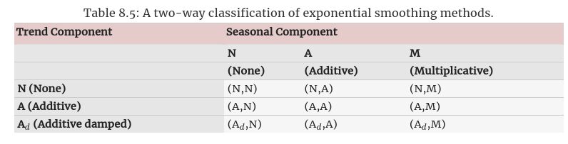

[toc]

# Exponential smoothing

- Exponential smoothing methods are **weighted averages of past observations**, with the **weights decaying exponentially** as the **observations get older** 

## Simple exponential smoothing

- This is the simplest exponential smoothing method.
- It is suitable for forecasting data with **no clear trend or seasonal pattern** 

- We had already discussed two methods in previous sections, The **naive** method and the **average** method.

- These methods can be rewritten as simple exponential smoothing method if we write them as follows
  - **Naive Method** 
    Can be thought of as a SES where all observation weights are zero except the last one
  - **Average Method**
    Can be thought of as a SES where all weights for all observations are equal

- The two methods above are two extremes, so we often want something **between these two extremes**
  - We want a method that priorotizes more recent observations, but without completely ignoring the early ones
  - Which is the concept behind SES

- Forecasts are calculated using **weighted averages**, where the weights decrease exponentially as observations come from further in the past.
  $$
    \hat y_{T+1|T} = \alpha y_T + \alpha (1 - \alpha) y_{T-1} + \alpha (1 - \alpha)^2 y_{T-2} + ..... 

  $$

  where $0 \leq \alpha \leq 1$ is called the **smoothing parameter**.

### Forms of SES
- There are **two equivalent forms** of exponential smoothing, both of them leads to the **same forecasting equation** as the on shown above

----------
#### Weighted average form

- The forecast at time $T+1$ is the moving average of the most recent observation and previous forecast.
  
  $$
    \hat y_{T+1|T} = \alpha y_T + (1 - \alpha) \hat y_{T|T-1}
  $$

- With this form, you have to start from somewhere, so it goes as follows
  $$
    \hat y_{2|1} = \alpha y_1 + (1 - \alpha) l_0
  $$
  where $l_0$ is a value we have to estimate, then we continue
  $$

    \hat y_{3|2} = \alpha y_2 + (1 - \alpha) y_{2|1}          \\
    \hat y_{4|3} = \alpha y_3 + (1 - \alpha) y_{3|2}          \\
    ..                                                        \\
    ..                                                        \\
    ..                                                        \\
    \hat y_{T+1|T} = \alpha y_T + (1 - \alpha) \hat y_{T|T-1} 
  $$

----------

#### Component form

- An alternative representation is the component form.
- For simple exponential smoothing, there is only one component $l_{t}$ (Other smoothing method covered later in this chapter will have other components)

  $$
    \text{Forecast equation   } \hat y_{t+h|t} = l_t \\
    \text{Smoothing equation  } l_t = \alpha y_t + (1-\alpha) l_{t-1}
  $$

- This is not useful on its own, but this form is easier when we start adding other components

----------

### Flat Forecasts

- Simple exponential smoothing has a **flat** forecast function
  $$
    \hat y_{T+h|T} = \hat y_{T+1|T} = l_T , \ h = 2,3,...
  $$

- This means that **all forecasts take the same value**, equal to the **last level component**
  - This is why these forecasts are only suitable if the time series has **no trend or seasonal component**

----------

### Optimisation

- The application of every exponential smoothing method requires the **smoothing parameters** and the **initial values** to be chosen.

- Specifically, in SES we need to select the values of $\alpha$ and $l_{0}$

- The choice can be based on **previous experience** 
  - However a **more reliable** way is to obtain values by **estimating them from the data** 

- We can also pose this as an optimization problem, and solve it by minimizing the least square error
  - However, this would involve a **non-linear minimiization problem**, so we need an optimization tool to solve it.

----------

## Methods with trend

### Holt's linear trend method

- This extends the simple method by adding a **trend component** $b_t$
  $$
    \text{Forecast equation   } \hat y_{t+h|t} = l_t + h b_t \\
    \text{Level equation      } l_t =\alpha y_t + (1-\alpha) (l_{t-1} + b_{t-1}) \\
    \text{Trend equation      } b_t = \beta^* (l_t - l_{t-1}) + (1 - \beta^*) b_{t-1}
  $$

- This means the forecast is **no longer flat** but **trending**    
- The forecast is now a **linear function of** $h$.

----------

### Damped trend methods

- The forecasts generated by Holt's linear method display a constant trend **indefinitely into the future**.
  - Empirical evidence indicates that these methods tend to **over-forecast**, especially for longer forecasts horizons

- This led to the introduction of a **dampening parameter** $\phi$
  - This parameter **dampens** the trend to a **flat line** sometime in the future

- These methods proved to be successful and are arguably the most popular individual methods when forecasts are required automatically for many series

- This leads to the rewriting of the equations as
  $$
    \text{Forecast equation   } \hat y_{t+h|t} = l_t + (\sum^h_{i=1} \phi^i) b_t \\
    \text{Level equation      } l_t =\alpha y_t + (1-\alpha) (l_{t-1} + \phi b_{t-1}) \\
    \text{Trend equation      } b_t = \beta^* (l_t - l_{t-1} + (1 - \beta^*)\phi b_{t-1}
  $$

- If $\phi = 1$, then this is identical to Holt's linear method.

- In practive, $\phi$ is **rarely less than $0.8$** as the damping has a **very strong effect** for smaller values.
  - Usually $0.8 \leq \phi \leq 0.98$

- Example
   
  $\phi = 0.9$

----------
  
## Methods with seasonality

- The previous methods were extended to **capture seasonality**

- There are now **three smoothing equations**, level $l_t$, trend $b_t$ and seasonal $s_t$ components, with **three corresponding parameters** $\alpha, \beta^*, \gamma$ for each one respectively

- **N.B.** we use $m$ to denote the **period of seasonality** 

### Two methods for seasonality

- There are two methods, the **additive method** and the **multiplicative method** 

- You should use the **additive** method when the **seasonal variations** are roughly **constant** throughout the series

- You should use the **multiplicative** method when the **seasonal variations** are changing **proportional to the level of the series**

- With the 
  - **Additive method** 
    - The seasonal component is expressed in **absolute terms** in the scale of the **observed series**.
    - In the **level equation** $l_t$, the series is seasonally adjusted by subtracting the seasonal component.
    - Within each year, the seasonal component will add up to **approximately zero** 

  - **Multiplicative method** 
    - The seasonal component is expressed in **relative terms (percentages)**
    - The **series** is seasonally adjusted by **dividing** through **by the seasonal component**.
    - Within each year, the seasonal component will sum up to **approximately $m$**.

#### Additive method

- The component form for the additive method is:
  $$
     \text{Forecast equation   } \hat y_{t+h|t} = l_t + h b_t + s_{t+h - m(k+1)}\\
    \text{Level equation      } l_t =\alpha (y_t - s_{t-m}) + (1-\alpha) (l_{t-1} + b_{t-1}) \\
    \text{Trend equation      } b_t = \beta^* (l_t - l_{t-1}) + (1 - \beta^*) b_{t-1} \\
    \text{Seasonal equation   } s_t = \gamma (y_t - l_{t-1} - b_{t-1}) + (1-\gamma) s_{t-m}
  $$
  where $k$ is the integer part of $\frac{h - 1}{m}$, which ensures that the estimates of the seasonal indices used for forecasting comes from the **final year of the sample**

#### Multiplicative method

- Written as
    $$
     \text{Forecast equation   } \hat y_{t+h|t} = (l_t + h b_t) s_{t+h - m(k+1)}\\
    \text{Level equation      } l_t =\alpha \frac{y_t}{ s_{t-m}} + (1-\alpha) (l_{t-1} + b_{t-1}) \\
    \text{Trend equation      } b_t = \beta^* (l_t - l_{t-1}) + (1 - \beta^*) b_{t-1} \\
    \text{Seasonal equation   } s_t = \gamma \frac{y_t}{l_{t-1} + b_{t-1}} + (1-\gamma) s_{t-m}
    $$

----------

- Example
   

#### Damped method with seasonality (multiplicative)

- Written as
    $$
    \hat y_{t+h|t} = (l_t + (\phi + \phi^2 + ... + \phi^h) b_t) s_{t+h - m(k+1)}\\
    l_t =\alpha \frac{y_t}{ s_{t-m}} + (1-\alpha) (l_{t-1} + \phi b_{t-1}) \\
    b_t = \beta^* (l_t - l_{t-1}) + (1 - \beta^*) \phi b_{t-1} \\
    s_t = \gamma \frac{y_t}{l_{t-1} + \phi b_{t-1}} + (1-\gamma) s_{t-m}
    $$

- Example where data fits series test data closely

   

----------

## Taxonomy of exponential smoothing methods

- Exponential smoothing methods are not restricted to those we have presented so far.
- By considering variations in the combinations of the trend and seasonal components, **nine** exponential smoothing methods are possible
   

  The trend could be None, additive or additive dampened, while the seasonal component could be None, additive or multiplicative.

- There are also **multiplicative trend methods** but they are not discussed as they **perform poorly**

----------

Missing 8.5, 8.6, 8.7

