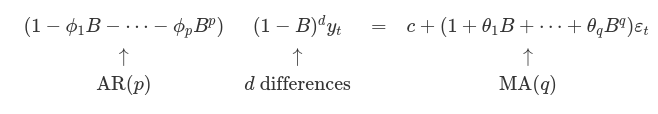
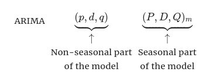

[toc]

# ARIMA models

- ARIMA models provide another approach to time series forecasting

- Exponential smoothing and ARIMA models are the **two most widely used approaches** to time series forecasting and provide complementary approaches to the problem

- While **exponential smoothing** models are based on a **description** of the **trend and seasonality in the data**, ARIMA models aim to **describe the autocorrelations in the data**

----------

## Stationarity and differencing

- A stationary time series is one whose **statistical properties** don't depend on the **time at which the series is observed**.
  - Thus, time series with trends, or with seasonality, are **not stationary** 
  - White noise is stationary, it doesn't matter when you observe it, it should look much the same at any point

- Some cases can be confusing, for example
  - A time series with cyclic behaviour (but no trend or seasonality) is stationary.
    This is because **cycles are not of a fixed length** so before we observe the series, we **cannot be sure where the peaks and the troughs of the cycles will be** 

- In general, a stationary time series will have **no predictable patterns** in the **long-term** 
  - Time plots will show the series to be **roughly horizontal** (although some **cyclic behaviour** is possible), with **constant variance** 

- Which of the following are stationary ?
   
  - Due to seasonality, we can rule (d), (h) and (i)
  - Trends and changing levels rule out (a), (c), (e), (f) and (i)
  - Increasing variance also rules out (i)
  - This only leaves **(b) and (g)** as stationary series

- At first glance, the strong cycles in (g) might appear to make it non-stationary, but these **cycles are aperiodic** 
  - So in the long term, the timing of these cycles is not predictable, hence the series is stationary

----------

### Differencing

- One of the ways to turn a **non-stationary** time series into a **stationary** time series is **differencing** 
  - Differencing here refers to computing the differences between consecutive observations

- Transformations such as **logarithms** can help to **stabilize the variance** of a time series

- **Differencing** can help stabilize the **mean** of the time series by removing changes in the level of a time series

- Differencing and Transformations are used together to turn time series into stationary by **reducing (eliminating)** trend and seasonality

- The ACF plot is also useful for identifying non-stationary time series
  - For a stationary time series, the ACF will drop to zero relatively quickly.
  - Also for non-stationary data, the value of $r_1$ is often large and positive.

   

----------

### Types of differencing

#### Random walk model

- The differenced series is the change between **consecutive observations** in the original series and can be rewritten as
  $$
    y_t^{'} = y_t - y_{t-1}
  $$

- The differenced series will only have $T - 1$ values.

- When the differenced series is white noise, the model for the original series can be rewritten as
  $$
    y_t - y_{t-1} = \epsilon_t
  $$
  where $\epsilon_t$ denotes white noise, we rearrange again to get
  $$
  y_t = y_{t-1} + \epsilon_t
  $$

- Random walks are widely use for **non-stationary data**, particularly financial and economic data.

- Random walks typically have
  - long periods of apparent up or down trends
  - sudden and unpredictable changes in direction

- Forecasts from a random walk model are equal to the **last observation** as **future movements are unpredictable** and are equally likely to be up ordown.
  - Thus, the random walk model underpins naive forecasts.

- A closely related model allows the differences to have a non zero mean.
  $$
    y_t - y_{t-1} = c + \epsilon_t \ \text{ or } \ y_t = c + y_{t-1} + \epsilon_t
  $$

  The value of $c$ is the average of the changes between consecutive observations.  
    - If $c$ is positive, then the average change is an **increase** in the value of $y$, so $y_t$ will tend to drift upwards

----------

#### Second-order differencing

- Occasionally the differenced data will not appear to be stationary and it may be necessary to **difference the data a second time** to make it stationary
  $$
    y_t^{''} = y_t^{'} - y_{y-1}
  $$

- In this case, $y_t^{''}$ will have $T-2$ values and it would model the **change in the changes**

- In practice, it is almost never necessary to go beyond second-order differences

----------

#### Seasonal differencing

- A seasonal difference is the between an observation and the previous observation for the **same season** 
  $$
    y_t^{'} = y_t = y_{t-m}
  $$

- This model just gives us **seasonal naive forecasts** 

----------

- To distinguish between seasonal differences and ordinary differences, we sometimes refer to ordinary differences as **first differences** 

- sometimes, it is necessary to take **both a seasonal difference and a first difference** to obtain stationary data
   

- When both differences are applied, it doesn't matter which difference is done first.
  - However, if the data is highly seasonal, seasonal differencing should be done first as it may be enough

----------

- Beware that applying more differences than required will **induce false dynamics and autocorrelations** that don't really exist in the time series.
  - Therefore, we apply as **little differences as possible** to obtain a stationary series.

- It is important that if differencing is used, the **differencing are interpretable**.

  - First differences are the change between one observation and the next.
  - Seasonal differences are the change between one year to the next.
  - Other lags are unlikely to make much interpretable sense and should be avoided

### Unit root tests

- This is a statistical hypothesis test of stationarity that are designed for determining whether differencing is required

- There are a different number of unit tests

----------

## Backshift notation

- The backward shift operator $B$ is a useful notation when working with time-series lags
  
  $$
    B_{y_t} = y_{t-1}
  $$
  Some references use $L$ for **lag** instead of $B$ for **backshift**

- There are other operators that can be applied to the **backshift operator** 
  - Power operator 
    $$
      B(B_{y_t}) = B^2y_t = y_{t-2} \\
      B^m y_t = y_{t-m}
    $$

  - Differencing
    $$
      y_t^{'} = y_t - y_{t-1} = y_t - B y_t = (1 - B) y_t
    $$
    So, a first difference can be represented by $(1 - B)$, similarly second-order differences
    $$
      y_t^{''} = y_t - 2 y_{t - 1} + y_{t-2} = (1 - 2B - B^2) y_t = (1 - B)^2 y_t
    $$
    A $d-th$ order difference can be written as
    $$
      (1-B)^d y_t
    $$
    Backshift notation is particularly useful when combining differences, as the operator can be treated using ordinary algebraic rules like so

    $$
      (1 - B) (1 - B^m) y_t = ( 1 - B - B^m + B^{m+1}) y_t \\ 
        = y_t - y_{t-1} - y_{t-m} + y_{t-m-1}
    $$
----------
## Autoregressive models

- In a multiple regression model, we forecast the variable of interest using a linear combination of predictors.
- In an **autoregression model**, we forecast the variable of interest using a **linear combination of past values** of the variable.
  - The term **autoregression** indicates that it is a **regression** of the variable **against itself**

- An autoregressive model of order $p$ can be written as
  $$
    y_t = \epsilon_t + c + \sum_{i=1}^p \phi_i y_{t-i}
  $$
  This is like a multiple regression but with lagged values of $y_t$ as predictors.
  We refer to this as an **AR(p) model** (autoregressive model of order $p$)

- Autoregressive models are remarkable flexible at handling a wide range of different time series patterns.

- Example of AR(1) and AR(2) models.
   
  The one on the left is $AR(1) \ y_t = 18 - 0.8 y_{t-1} + \epsilon_t$
  The one on the right is $AR(2) \ y_t = 8 + 1.3 y_{t-1} - 0.7 y_{t-2} + \epsilon_t$

----------

### Restrictions on model parameters

- For an AR(1) model:
  - when $\phi_1 = 0$ and $c = 0$, $y_t$ is equivalent to white noise
  - when $\phi_1 = 1$ and $c = 0$, $y_t$ is equivalent to a random walk
  - when $\phi_1 = 1$ and $c \neq 0$, $y_t$ is equivalent to random walk with drift
  - when $\phi_1 \lt 0$, $y_t$ tends to oscillate around the mean

- We normally **restrict** autoregressive model to **stationary data**, in which case **some constraints** on the parameter values are required
  - For an AR(1) model: $-1 \lt \phi_1 \lt 1$
  - For an AR(2) model: 
      $$
        -1 \lt \phi_2 \lt 1
        \\ \phi_1 + \phi_2 \lt 1
        \\ \phi_2 - \phi_1 \lt 1
      $$

- There are restrictions for higher order autoregressive models, but they are handled by the library.

----------

## Moving average models

- Rather than using past values of the forecast variable in a regression, a moving average model uses **past forecast errors** in a regression like model
  $$
    y_t = c + \epsilon_t + \sum_{i = 1}^q \theta_i \epsilon_{t - i}
  $$
  where $\epsilon_t$ is white noise.
  We refer to the model above as an **MA($q$) model** ((Moving average model of order $q$.

- Ofcouse, we **don't observe** the values of $epsilon_t$, so it is not really a regression in the usual sense.

- Notice that each value of $y_t$ can be thought of as a weighted moving average of the past few forecasts (although coefficients won't always sum to 1).

- Moving average models shouldnt be confused with moving average **smoothing** 
  - An MA(q) model is used to **forecast future values** 
  - A smoothing MA is used for **estimating the trend-cycle of past values** 

 

- Example
  - Left MA(1) : $y_t = 20 + \epsilon_t + 0.8 \epsilon_{t-1}$
  - Right MA(2) : $y_t = \epsilon_t - \epsilon_{t - 1} + 0.8 \epsilon_{t-2}$
   
----------

### Rewriting models

- It is possible to write any **stationary** AR($p$) model as an MA($\infin$)
  e.g.
  $$
    y_t = \phi_1 y_{t-1} + \epsilon_t \\

     \phi_1 (\phi_1 y_{t-2} + \epsilon_{t-1}) + \epsilon_t \\
     \phi_1^2 y_{t-2} + \phi_1 \epsilon_{t-1}) + \epsilon_t \\
     \phi_1^3 y_{t-3} + \phi_1^2 y_{t-2} + \phi_1 \epsilon_{t-1}) + \epsilon_t \\
     ...
  $$
  provided $-1 \lt \phi_1 \lt 1$, the value of $phi_1^k$ will get smaller as $k$ gets larger, so eventually we obtain
  $$ 
   y_t = \epsilon_t + \phi_1 \epsilon_{t-1}) + \phi_1^2 y_{t-2}+ \phi_1^3 y_{t-3} + ...,
  $$
  which is an MA($\infin$) process.

- If we impose some constraints on the MA parameters, we can achieve the same things (MA($q$) -> AR($\infin$))
  - If we apply these constraints, the MA model is called **invertible**

- Invertibility constraints
  - For an MA(1) model: $-1 \lt \theta_1 \lt 1$
  - For an MA(2) model: 
      $$
        -1 \lt \theta_2 \lt 1
        \\ \theta_1 + \theta_2 \lt 1
        \\ \theta_1 - \theta_2 \lt 1
      $$
- Similarly, there are constraints for higher orders that are handled by the libraries.

----------

## Non-seasonal ARIMA models

- If we combine **differencing** with **autoregression** and a **moving average** model, we obtain a **non-seasonal ARIMA model** 

- ARIMA is an acronym for AutoRegressive Integrated MovingAverage

- The full model can be written as
  $$
    y_t^{'} = \epsilon_t + c +  \sum_{i=1}^p \phi_i y_{t-i}^{'} + \sum_{i=1}^q \theta_i \epsilon_{t-i}
  $$
  There may be more than one difference in which case, we would've written $y_t^{''}$ depending on how many differences there is.

- We call this an ARIMA($p,d,q$) model, where 
  - $p = $ order of **autoregressive** part
  - $d = $ degree of first differencing involved
  - $q= $ order of the moving average part

- The same stationary and invertibility conditions are used for autoregressive and moving averages also apply to an ARIMA model

- Once we start combining components in this way, it is easier to work with the **backshift notation** 
 
   

- Selecting appropriate values for $p, d$ and $q$ can be difficult.
  - Libraries do that automatically for you, we'll study how do they decide that and some other methods for manual choice
----------

### Understanding ARIMA models

- Here, we try to understand how the libraries pick the parameters for ARIMA.

- The constant $c$ has an important effect on the long-term forecasts obtained from these models
  - If $c = 0$ and $d=0$, the long-term forecasts will go to zero
  - If $c = 0$ and $d=1$, the long-term forecasts will go to a non-zero constant
  - If $c = 0$ and $d=2$, the long-term forecasts will follow a straight line
  - If $c \neq 0$ and $d=0$, the long-term forecasts will go to the mean of the data
  - If $c \neq 0$ and $d=1$, the long-term forecasts will follow a straight line
  - If $c \neq 0$ and $d=2$, the long-term forecasts will follow a quadratic trend (not recommended)

- The value of $d$ also has an effect on the **prediction intervals**, the higher the value of $d$, the more rapidly prediction intervals increase in size
  - For $d=0$, the long-term standard deviation will go to the standard deviation of the historical data (intervals are essentially the same)

- The value of $p$ is important if the **data shows cycles**. 
  - To obtain **cyclic forecasts**, it is necessary to have $p \geq 2$, along with some **additional conditions** on the **parameters**.
  - For an AR(2) model, the cyclic behaviour occurs if $\phi_1^2 + 4 \phi_2 \lt 0$.
    In that case the **average period of the cycle is** 
      $$
        \frac{2 \pi}{cos^{-1} (\frac{\phi_1 (1 - \phi_2)}{4\phi_2}}
      $$

----------

### ACF and PACF plots

- It is not possible to tell what values of $p$ and $q$ are appropriate for the data from a **time plot**.
- However, it is **sometimes possible** to use the **ACF plot**, and the closely related **PACF** plot to **determine appropriate values** for $p$ and $q$.
- PACF measure the relationship between $y_t$ and $y_{t - k}$ after removing the effects of lags
  - Each partial autocorrelation can be estimated as the **last coefficient** in an **autoregressive model**.
    Specifically, $\alpha_k$ ($k$-th partial autocorrelation coefficient), is equal to the estimate $\phi_k$ in an AR($k$) model.

- In practice, there are more efficient algorithms for computing $\alpha_k$ than fitting all of these autoregressions, but they give the same results.

- ACF and PACF of the data
   

   

----------
- If the data are from ARIMA(p,d,0) or ARIMA(0,d,q) model, then the ACF and PACF plots can be helpful in determining the value of $p$ or $q$.
  - If $p$ and $q$ are **both positive**, then the plots **don't help**

- The data **may follow ARIMA(p,d,0)** model if the ACF and PACF of the **differenced data** show the following **patterns**
  - The ACF is **exponentially decaying** or **sinusoidal** 
  - There is a significant spike at lag $p$ in the PACF, but none beyond lag $p$

- The data **may follow ARIMA(0,d,q)** model if the ACF and PACF of the **differenced data** show the following **patterns**
  - The PACF is **exponentially decaying** or **sinusoidal** 
  - There is a significant spike at lag $q$ in the ACF, but none beyond lag $q$

----------

## Estimation and Order selection

### Maximum likelihood estimation

- Once you identify the model order (i.e. the values of $p,d$ and $q$), we need to estimate the parameters
  - The parameters are $c$ - $\phi_1,...,\phi_p$ - $\theta_1,....,\theta_q$

- The parameters are estimated by minimizing the Least square error just like before

- **N.B.** ARIMA models are **more complicated to estimate** than regression models, so different software might give different parameter values as each of them might have their own way of estimation

----------

### Information Criteria

- These criteria are modified for ARIMA (not the same as in the case of regression)

- They are useful when selecting the appropriate $p$ and $q$ only (not difference).
  - This is because the differencing changes the data on which the likelihood is computed, therefore it doesn't make sense to compare the values.

----------
## ARIMA under the hood in `fable`

- Read on them at [FPP-link](https://otexts.com/fpp3/arima-r.html)

----------

## Forecasting with ARIMA

### Point forecasts

- Point forecasts can be calculated using the following 3 steps
  1. Expand the ARIMA equation so that $y_t$ is on the left hand side and all other terms are on the right
  2. Rewrite the equation by replacing $t$ with $T + h$
  3. On the right hand side, replace **future observations** with their **forecasts**, **future errors** with **zero**, and **past errors** with the **corresponding residuals** 

  Starting from $h = 1$, these steps are then repeated for $h=2,3,...$ until all forecasts have been calculated.

### Prediction intervals

- The calculation of ARIMA prediction intervals is more difficult, and the details are largely beyond the scope of the book.

----------

## Seasonal ARIMA models

- So far, we have restricted our attention to non-seasonal data and non-seasonal ARIMA models
  - However, ARIMA models are also capable of modelling a wide range of seasonal data

- A seasonal ARIMA model is formed by **including additional seasonal terms in the ARIMA models**, it is written as follows
   

  where $m = $ the seasonal period.
  We use **uppercase notation** for the **seasonal parts** of the model, and **lowercase notation** for the **non-seasonal parts** 

- The seasonal part of the model consists of terms that are similar to the non-seasonal components of the model, but **involve backshifts of the seasonal period** 
  - e.g. an ARIMA$(1,1,1)(1,1,1)_4$ model (without a constant) is for quarterly data ($m=4$), and can be written as
    $$
      (1 - \phi_1 B) (1 - \phi_1 B^4) (1-B)(1-B^4) y_t = (1+ \theta_1 B)(1+ \theta_1 B^4) \epsilon_t
    $$
    The additional seasonal terms are simply **multipled by the non-seasonal terms**.

----------

### ACF/PACF

- The seasonal part of an AR or MA model will be seen in the **seasonal lags of the PACF and ACF** 
  - e.g. an ARIMA$(0,0,0)(0,0,1)_{12}$ model will show
    - A spike at **lag 12** in the **ACF** but no other significant spikes
    - Exponential **decay** in the seasonal lags of the **PACF** (i.e. at lags 12, 24, 36)
  - e.g. ARIMA$(0,0,0)(1,0,0)_{12}$
    - Exponential decay in the **seasonal lags of the ACF** 
    - A single significant **spike** at **lag 12** in the **PACF** 

- When considering the appropriate **seasonal orders** for a **seasonal ARIMA model**, restrict attention to the seasonal lags

- The modelling procedure is **almost the same** as for **non-seasonal** data, except that we need to select **seasonal AR and MA terms** as well as the **non-seasonal components** of the model.

- This is all best illustrated via examples

----------

### Example : Monthly US leisure and hospitality employment

- Data
   

  The data is clearly **non-stationary**, with **strong seasonality** and **a non-linear trend** 

- Here are the steps for dealing with this dataset.

1. We take a **seasonal difference** and plot the **ACF and PACF** for the result
   

2. Since the data is clearly still **non-stationary**, we take the first difference of the data
   

3. Our aim now is to find an **appropriate ARIMA model** based on the ACF and PACF shown in step 2.
  - The significant spike in the ACF at lag 2 suggests a **non-seasonal MA(2)**
    and the spike at lag 12 in the ACF suggests a **season MA(1)** 
  - Consequently, we begin with an ARIMA$(0,1,2)(0,1,1)_{12}$ model, indicating a first difference, seasonal difference, and non-seasonal MA(2) and seasonal MA(1) component.
  - If we had started with PACF, we may have selected ARIMA$(2,1,0)(0,1,1)_{12}$ (used PACF for non-seasonal and ACF for seasonal.
  - We will try these two models and let the library try a third one (auto-picking order)

4. We pick the model with the best test value and plot the residuals to check that it fits correctly
   
  We can see that there is no correlations between residuals (except 1 spike only which is okay 95% confidence interval).
  So, the residuals pass for white noise.

5. Forecasting the next 3 years
   

----------

